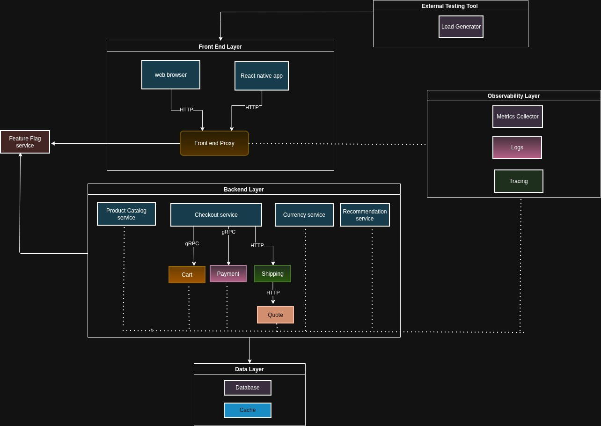

## Cloud-Native Microservices Deployment with CI/CD & Observability

This Project focuses on designing and deployment of cloud-based microservices based on modern DevOps best practices.
It progressively integrates infrastructure automation, containerized application deployment and orchestration, 
CI/CD pipelines, security scanning, observability to simulate a real-world production environment.

The project uses a real-world open-source e-commerce application based on microservices architecture.
The system is instrumented with observability tooling to monitor interactions between frontend and backend services.

The application includes several independent services such as:

- Shopping Cart Service

- Currency Service

- Payment Service

- Product Catalog Service

- Recommendation Service

- Shipping Service

- Checkout Service

- Quote Service

- Advertisement Service

- Frontend Web Application

These services communicate over gRPC and HTTP APIs and are deployed using containerized infrastructure.

## Application Architecture:

The architecture demonstrates how distributed microservices interact within a containerized environment
while providing observability through tools such as:

- OpenTelemetry

- Prometheus

- Grafana

- Jaeger

These tools collect metrics, logs, and distributed traces to help monitor service performance, detect failures, 
and troubleshoot system behavior.

