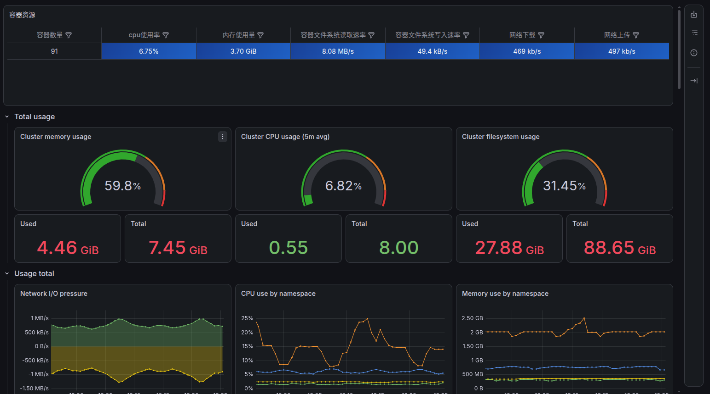
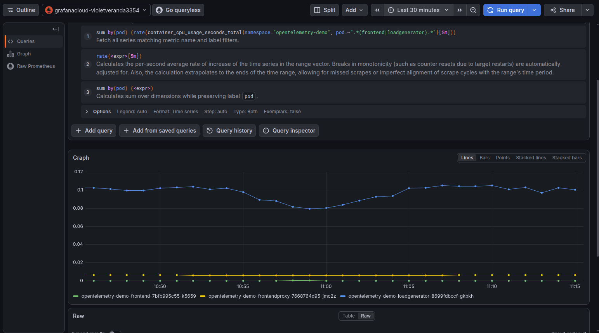
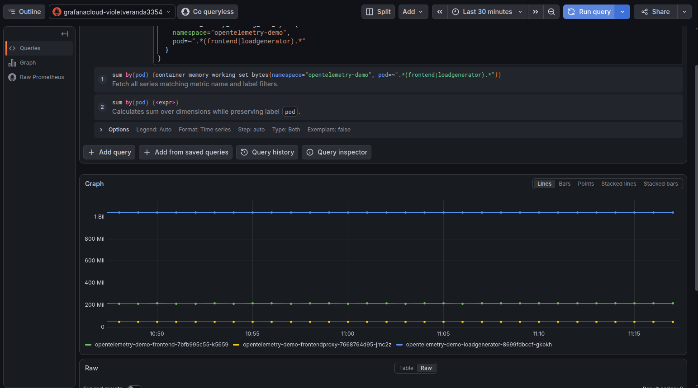
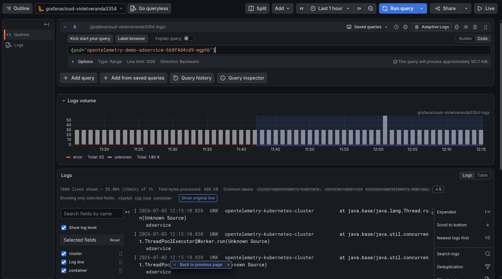

## EKS cluster monitoring using Grafana Alloy Agent

This project requires a kubernetes monitoring agent to collect infrastructure metrics such as CPU/Memory usage, nodes health,
container resource consumption per pod, pod stout logs and sending them to Grafana Cloud for displaying it on dashboards. 
It considers two Helm chart option for this, such as grafana/K8s-monitoring and grafana/alloy.

grafana/k8s-monitoring — This chart that bundles Alloy, Alloy operator, pre-built dashboards, and opinionated default configurations.

grafana/alloy — The standalone Grafana Alloy agent chart requiring explicit River pipeline configuration.

Application observability (HTTP request rates, distributed traces, service-level latency) is handled by the openTelemetry demo's 
built-in collector pipeline, ie, OTel SDK → OTLP → Jaeger + in-cluster Prometheus. The instrumentation of application and infrastructure
is seperated along development team and platform team respectively. In a production environment, both pipelines would feed into a unified 
Grafana dashboard combining infrastructure metrics and application metrics.

## Decision:

The grafana/k8s-monitoring chart introduced an additional operator-managed reconciliation layer. In the project's configuration, resources generated 
and managed by the Alloy Operator conflicted with the expected Argo CD ownership and synchronization model, resulting in persistent OutOfSync or health issues. To reduce the number of reconciliation layers and simplify GitOps ownership, the project replaced k8s-monitoring with the standalone grafana/alloy Helm chart. grafana/alloy Helm chart deployed as a DaemonSet and managed by Argo CD. Alloy configuration is explicitly defined in the Git repository, providing direct control over telemetry discovery, relabeling, scraping, and forwarding behavior.

Key configuration decisions of Grafana/alloy:

Controller type: Alloy is deployed as a DaemonSet so that one collector runs on each node, enabling node-local collection and 
                 scraping of node-level telemetry such as kubelet and cAdvisor metrics where configured and permitted.
Pod discovery:   namespace-scoped to opentelemetry-demo to reduce Kubernetes API server load
Log enrichment:  discovery.relabel to promote __meta_kubernetes_* labels into permanent Loki stream labels

## Rationale:
 
- k8s-monitoring chart
  Pros: Minimal configuration, pre-built dashboards included, opinionated defaults.
  Cons: Alloy Operator causes permanent ArgoCD OutOfSync conflict. 

- Grafana Cloud kubectl apply (built-in integration)
  Grafana Cloud provides a single kubectl apply command to deploy monitoring.
  Pros: Simplest set up
  Cons: Bypasses GitOps entirely. No audit trail. No drift detection. No rollback via Git. 
        Incompatible with the project's ArgoCD-first architecture.

- Standalone grafana/alloy chart 
  Pros: Argo CD directly manages the Helm release and declarative resources for the Alloy deployment,
        while Kubernetes controllers manage the runtime objects generated from those resources 
  Cons: More verbose configuration, River syntax must be learned and no pre-built dashboards.

## Tradeoffs:

| Consideration| Upside | Downside |
|---|---|---|
| Standalone Alloy vs k8s-monitoring | Simpler resource ownership and explicit configuration | More manual configuration
| DaemonSet deployment | Node-local telemetry collection | Consumes resources on every node
| Namespace-scoped discovery | Reduced telemetry and API/discovery scope | No automatic monitoring of other namespaces
| Manual alerting | Full control over alert rules | PromQL/alert rules must be designed and maintained

## Key Takeaways:

- Standalone Grafana Alloy provides direct control over the Kubernetes monitoring pipeline and integrates cleanly with the 
  project's GitOps-managed deployment model.
- A DaemonSet ensures node-level collection coverage but introduces predictable CPU and memory overhead on every node.
- Namespace-scoped discovery reduces monitoring scope and resource consumption but requires additional configuration when new namespaces
  must be monitored.
- Application and infrastructure telemetry can be managed independently while still being correlated through common Kubernetes metadata 
  such as cluster, namespace, workload, and Pod identifiers.

## EKS cluster running 20-microservice OpenTelemetry demo

The dashboard confirms that Alloy is collecting node and workload telemetry from the EKS cluster.

## CPU spike from load generator traffic

CPU utilization increased during synthetic traffic generated by the OpenTelemetry Demo load generator, demonstrating that 
infrastructure telemetry reflects application workload behavior.

## Memory Per Pod

Pod-level memory metrics provide visibility into resource consumption and help identify workloads approaching configured memory limits.

## Loki — adservice logs with namespace/pod/cluster labels visible

Kubernetes metadata enables logs to be filtered by labels such as namespace, Pod, and cluster.

