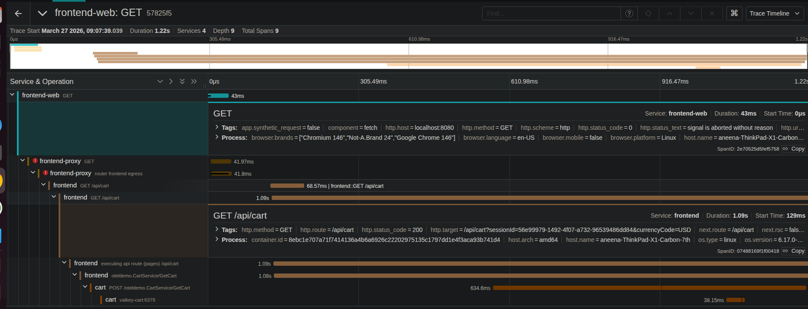
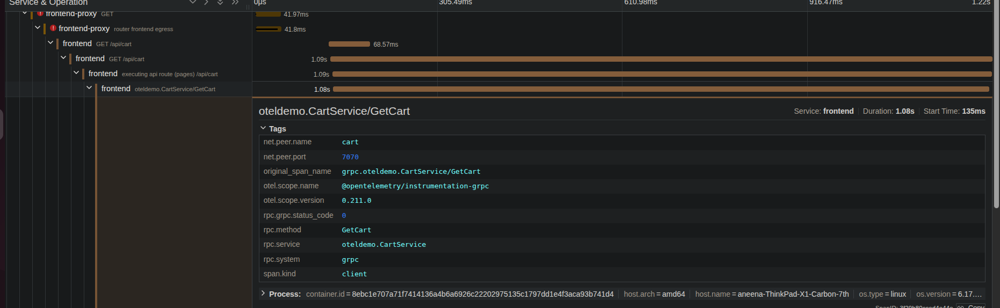
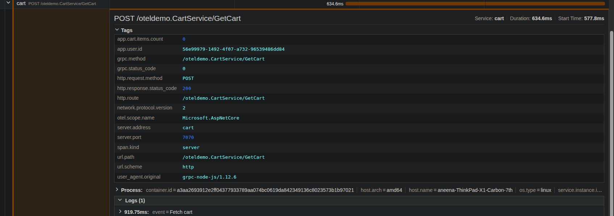

## A real-world distributed system failure:

This case study reproduces a real production issue where misconfigured timeouts lead to failed requests and wasted backend processing.

## Scenario:

This task simulates a distributed system failure caused by  a client-side timeout misconfiguration and an increased latency on cart service 
in opentelemetry ecommerce application. It demonstrates, how a mismatch between client side timeout and backend processing time leads to
misaligned Service Level Agreements(SLAs) and inefficient system behavior.

## Objective:

- Introduce a Frontend timeout misconfiguration
- Simulate a backend latency in the Cart Service
- Observe and analyze the system behavior using Jaeger distributed tracing tool.

## Experiment SetUp:
 
- Configured a timeout of 40ms in the file 'src/frontend/utils/Request.ts'
- The 'AbortController()' method is used to cancel requests exceeding the timeout.
- Introduced a task latency in  Cart Service to simulate a slow backend, for instance, database delay, cache delay
- Configured a delay of 120ms in the file 'src/cart/src/services/CartService.cs'

## Observations in Jaeger:

Failure of Frontend Span: 
- A duration of more than 40 ms
- Error: Request is aborted before completion.
- Status: Failed
- An http.status_code = 0

Success status of the Backend span:
- Duration of the cart service ~600 ms
- An http.status_code = 200
- Backend continues processing even after client disconnects

## Root Cause Analysis:

Mismatch between frontend timeout of 40 ms and a backend latency of 120+ ms
- No cancellation propagation from client to backend
- Leads to orphaned requests

## Key insights:

- The client aborts the request due to aggressive timeout  and the backend continues processing the request
leads to failed user experience, wastage of backend resources and overall, it leads to inefficient system behavior.

## Key Takeaways:

This Experiment replicates a real production issue and the  importance of alligned timeouts across services:

- The end to end tracing is critical for debugging distributed systems.
- Timeouts must be aligned with backend latency expectations.
- Ideally:  timeout > backend latency for system efficency
- failure injection is crucial for capturing real-world production issues.
- Lack of cancellation handling leads to resource wastage.

