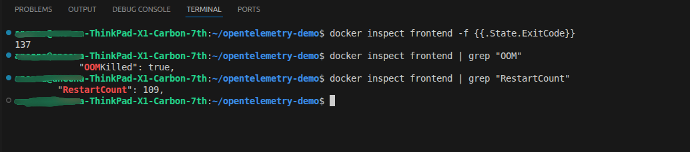
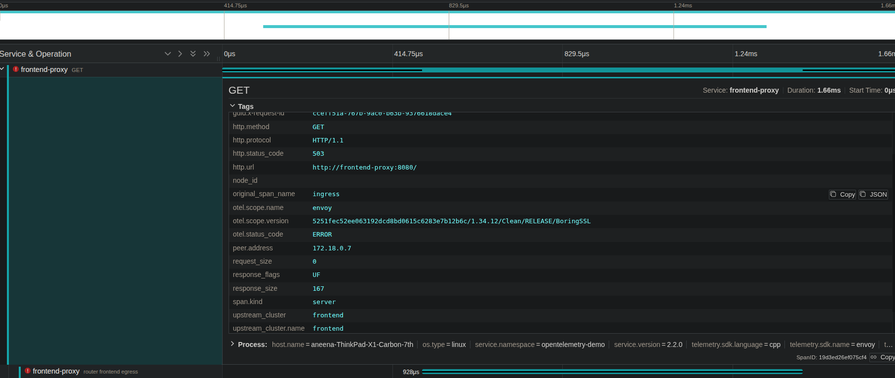

## Experiment: Out-Of-Memory Failure

I introduced a resource constraint on Frontend service to understand the failure behavior in a microservice system,
For that the memory limit for the Frontend service is reduced from 250MB to 10MB.
This experiment simulates a real-world production issue and demostrates, how observability tools like Jaeger helps
to identify the root cause of the problem.

## Observations:

- The Browser displayed 'connection refused' message and service became unavailable. 
- The Frontend container crashed repeatedly
- The RestartCount of the Frontend service increased significantly

## The output of Docker compose analysis using terminal:

 
This confirms that the container was termintaed by the system due to memory exhaustion. 

## The output of Jaeger Trace analysis:

- HTTP status code: 503
- Error observed at frontend-proxy
- No downstream frontend span

## Root Cause Analysis:

- The Frontend service memory usage exceeded the memory configuration limit.
- The process was killed by the kernel through SIGKILL
- The Frontend proxy failed to establish a connection.
- Frontend Proxy returned HTTP 503 to the client
- The service became unavailable by throwing connection refused message

## Key Takeways:

- Resource constraints directly impact the service availability
- Failures in one service propagates upstream in microservice architectures. 
- Distributed tracing helps to  identify failure location
- Combining docker debugging and distibuted tracing tools improves efficiency. 
